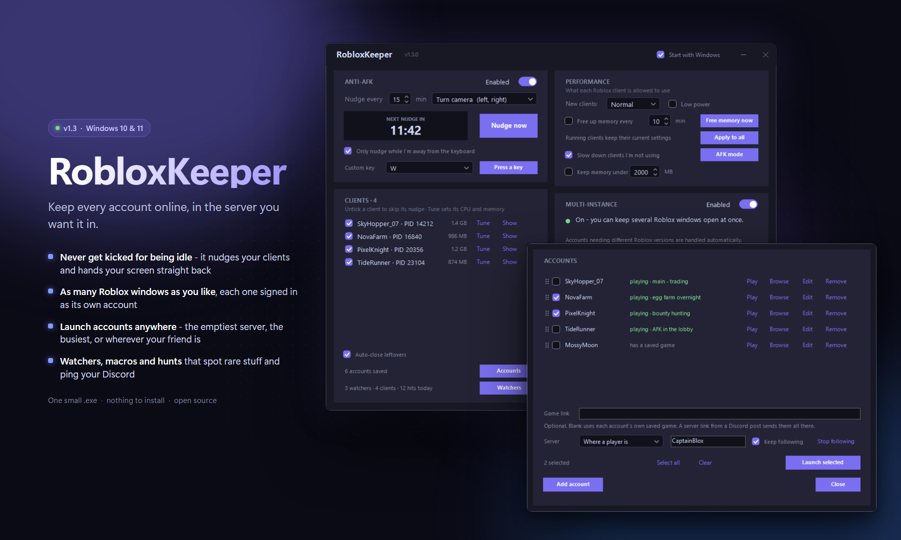

# RobloxKeeper

**Anti-AFK + Multi-Instance manager for Roblox on Windows.**
One tiny executable. Zero dependencies. No injection, no memory access, no file tampering.

[](https://github.com/VladDerK1ng/RobloxKeeper/actions/workflows/build.yml)


<p align="center">
  
</p>

---

## Features

| | |
|---|---|
| **Anti-AFK** | Nudges every selected Roblox client on a timer (default 15 min, adjustable 1-19) so the 20-minute idle kick never fires. Briefly focuses each client, sends the input, and returns focus to whatever you were doing. Minimized clients are restored, nudged, and re-minimized. The countdown only runs while a selected client is actually open. |
| **Nudge key profiles** | Choose what the nudge sends: **Turn camera** (`←`, `→` - default), **Zoom out + in** (`O`, `I`), or **Jump** (`Space`). Pick whichever is safe for your game's keybinds. |
| **Per-client selection** | Every running client appears as a row in the Clients panel (scrollable, so any number of clients works). Untick one and the nudger leaves it alone - run anti-AFK on two accounts while a third stays untouched. **Show** brings that client's window to the front so you can tell which is which. New clients default to enabled. |
| **Multi-Instance** | Holds Roblox's `ROBLOX_singletonMutex` (and `ROBLOX_singletonEvent`) so multiple clients can run simultaneously. A dedicated thread queue-waits on the mutex the same way Roblox clients do, so ownership transfers to RobloxKeeper at the kernel level the instant it frees - a launching client can never win the race. If clients already own it, one click on **Close all Roblox** clears them (ghost processes included) and takeover is immediate. |
| **Client monitor** | Live count of open Roblox clients with each one's memory use, plus detection of window-less "ghost" Roblox processes (they can silently block multi-instance) with a one-click **End background** button. Processes still starting up are shown as *starting* rather than *stuck*, so a normal launch never looks like a fault. |
| **Per-client resources** | Each client row has a **Tune** link: set its **CPU priority**, pin it to a number of **cores**, switch on **efficiency mode** (EcoQoS - the same throttling as Task Manager's), or **trim its memory** on the spot. Successive clients are given non-overlapping core blocks, so "4 cores" on two clients means two sets of four that genuinely don't fight. |
| **Client defaults + auto-trim** | The **Performance** card sets the profile every newly launched client gets, so the foreground account can outrank the AFK ones without touching anything per-launch. **Auto-trim** hands idle memory back to Windows on a timer, skipping whichever client you're actually looking at. **Trim all now** does it immediately, from the window or the tray menu. |
| **Single instance** | Launching RobloxKeeper while it's already running won't open a second copy - it surfaces the existing window instead, restoring it from the tray if needed. |
| **Start with Windows** | Optional autostart toggle (top-right). With it on, RobloxKeeper starts **minimized to the tray** at boot and holds the mutex before any Roblox client can exist, which makes the launch-order problem impossible. |
| **Saved settings** | Every setting - anti-AFK on/off, interval, nudge profile, multi-instance, auto-clear ghosts, client defaults, auto-trim - is written to `%APPDATA%\RobloxKeeper\settings.txt` and restored on the next launch. Per-client **Tune** overrides are deliberately session-only: Windows recycles PIDs, so a saved override would eventually land on an unrelated process. |
| **Diagnostic log** | Every client open/close is logged with the reason, naming a **singleton kill**, the **Roblox bootstrapper**, or a normal close. **Copy log** puts the whole thing plus your version, Windows build, settings, and Roblox launch path on the clipboard for sharing. |
| **Launch-path check** | Warns at startup if Roblox launches via the legacy bootstrapper (`RobloxPlayerLauncher`), which closes running clients on every launch no matter who holds the mutex - the one failure mode multi-instance cannot fix from outside. |
| **Different versions per account** | Roblox does not give every account the same client version, and it reinstalls to switch - an installer that closes every open client. RobloxKeeper spots the account that is mid-launch, reads its join URL, stops the installer, and starts that account **directly on the version it needs**. No reinstall happens, so your other clients are never touched. Fully automatic, any number of accounts, nothing to configure. |
| **Update shielding** | A background Roblox update that would close your clients is held back while you are playing, and installs by itself once you close them all. |
| **Auto-clear ghosts** | Stuck window-less Roblox processes are ended automatically once they have been window-less for 150 seconds - long enough that they cannot be a client still starting up. A leaked client wastes a gigabyte of RAM whether or not multi-instance is on, so nothing else gates this. On by default; untick in the Clients panel to disable. |
| **Start menu entry** | Adds itself to the Start menu the first time it runs, so you can just press the Windows key, type "RobloxKeeper" and hit enter. If you move the exe, the entry is repointed automatically on the next run. |
| **Automatic updates** | On start it checks GitHub for a newer release. If one exists it asks first, and only downloads and restarts if you say yes. Say no and it carries on, offering again next time. If you are offline or GitHub is unreachable, nothing happens and nothing is logged in your way. |
| **Quality of life** | Dark modern UI, live countdown, activity log, minimize-to-tray with tray menu (Open / Nudge now / Trim client memory / Exit). |

## Quick start

1. Download (or build) `RobloxKeeper.exe` and run it - **before** opening Roblox.
2. Open as many Roblox clients as you need.
3. Minimize RobloxKeeper to the tray. Done.

After the first run it is in your Start menu, so from then on you can just search "RobloxKeeper" to open it.

Both features are enabled by default on launch.

> **Note:** one Roblox *account* can't be in two games at once - that's enforced server-side. Multi-instance is for running multiple accounts (or one in-game plus others at the home screen).

## Verifying a download

Releases are built and published by [GitHub Actions](.github/workflows/release.yml) straight from the tagged
source - nobody uploads a binary by hand. Given the app touches `SendInput`, the registry and autostart,
you shouldn't have to take that on trust:

- **Check the build provenance.** Every release carries a signed attestation tying that exact exe to the
  commit and workflow run that produced it:

  ```bat
  gh attestation verify RobloxKeeper.exe --repo VladDerK1ng/RobloxKeeper
  ```

- **Check the hash.** Each release ships a `RobloxKeeper.exe.sha256` next to the exe; compare it with
  `Get-FileHash RobloxKeeper.exe -Algorithm SHA256`.

- **Read the build.** The release notes link the commit and the workflow run, and the entire compiler
  invocation is the one line in [build.bat](build.bat) - the same script the workflow runs.

One caveat, stated plainly: the .NET Framework `csc.exe` this project uses has no `/deterministic` switch,
so two builds of the same source produce binaries that differ in embedded GUIDs and timestamps. You can
verify the release was built by the workflow from a given commit; you cannot byte-compare it against your
own local build.

## Building from source

No SDK or IDE required - it compiles with the C# compiler that ships inside Windows:

```bat
build.bat
```

That's it. The script generates the app icon (`make-icon.ps1`) and produces `RobloxKeeper.exe` using
`csc.exe` from the .NET Framework already on your machine. It is the single build command in the
repository - CI runs this same script, so a local build and a published build never drift apart.

To publish a new version (maintainers):

```bat
release.bat 1.4.2
```

That bumps `APP_VERSION` in `src/AppInfo.cs`, test-compiles, commits, pushes, and pushes the `v1.4.2` tag.
The tag is what triggers the release workflow, which rebuilds from that tag and publishes the exe itself.
The workflow refuses to publish if the tag and `APP_VERSION` disagree.

## Project layout

```
src/
  AppInfo.cs             version + repo constants (release.bat and CI stamp this)
  Program.cs             entry point, single-instance guard
  MainForm.cs            window state, the one-second loop, logging
  MainForm.Ui.cs         layout, client rows, performance handlers
  MainForm.Afk.cs        the anti-AFK nudge
  MainForm.Install.cs    Roblox reinstall detection, version switching, repair
  MutexKeeper.cs         the queue-wait that holds ROBLOX_singletonMutex
  ClientTracker.cs       finds clients, tells "starting" from "stuck"
  GhostCleaner.cs        ends leaked window-less clients
  PerformanceManager.cs  per-client priority, affinity, EcoQoS, memory trim
  ClientTuneDialog.cs    the per-client Tune window
  RobloxInstall.cs       version folders, protocol registration, shortcuts, launchers
  AppSettings.cs         settings.txt load/save
  Updater.cs             self-update against the GitHub releases API
  Native.cs              every P/Invoke, in one place
  InputSender.cs         SendInput scan codes and focus handling
  Controls.cs            Card, ScrollPanel, dark-theme widget builders
  ThemedControls.cs      owner-drawn checkbox, toggle, stepper and picker
  Theme.cs               colours
```

Windows draws checkboxes, spinners and combo buttons with the system theme, which puts white boxes and
grey chrome on top of near-black cards. `ThemedControls.cs` replaces those with owner-drawn equivalents -
including a picker whose dropdown is a popup the app paints itself, because a `DropDownList` combo never
lets go of its own border and drop button. The window is borderless for the same reason: the system title
bar is bright chrome no dark theme can reach, so `BuildTitleBar` draws its own and hands dragging back to
the OS via `WM_NCLBUTTONDOWN`, which keeps snapping and multi-monitor behaviour intact.

Cards use a 20px gutter, a heading at y=14 with any explanatory line stacked beneath it, and fixed-height
rows so labels and inputs centre on the same line. Because the layout is hand-placed rather than driven by
a layout engine, the geometry is covered by tests that measure the real strings in the real fonts -
rewording a status line is a layout change here, and the tests treat it as one.

## RobloxKeeper's own footprint

Measured on Windows 11 while idle: about **0.8% of one CPU core** and **67 MB** of RAM, steady, with no memory or handle growth over time. The one-second loop takes a single snapshot of running processes and answers every question from it, rather than walking the process table repeatedly.

Running two Roblox clients costs whatever two Roblox clients cost on your machine (mostly GPU and RAM), and the number of installed Roblox versions makes no difference. The per-client work added by the Performance card is a memory reading per client per tick, plus a priority/affinity call only when a client's settings have actually drifted from its profile - so it is proportional to the number of clients, not to time.

The only moment it touches your desktop is a nudge: it focuses each selected client for roughly half a second, sends the keys, and hands focus back. If you are typing at that moment you will notice it. Nothing else it does steals focus.

## How it works

**Anti-AFK** uses `SendInput` with hardware scan codes - the same level of the input stack a physical keyboard writes to, which is why clients reading raw input register it. Extended keys (arrows) are sent with the `E0` flag so they aren't misread as numpad input. Each nudge: focus client → send keys → restore your previous window. The two-key profiles (zoom out/in, turn left/right) cancel themselves out, so your camera ends up where it started.

**Multi-Instance** relies on how Roblox enforces single-instancing: at startup the client checks a named mutex, `ROBLOX_singletonMutex`. When an external process already owns that mutex, clients skip the "close the other instance" path entirely. RobloxKeeper holds it from a dedicated thread that *queue-waits* on the mutex - Roblox clients wait in the same kernel queue, so whoever is queued first wins, and RobloxKeeper queues the moment it starts. When the owning client exits, ownership transfers to RobloxKeeper in microseconds; in testing, a competitor hammering the mutex with 113,000+ acquire attempts during the handover never won it once.

The most common reason multi-instance "sometimes doesn't work" with any tool: closing a Roblox window doesn't always end its process. A window-less ghost process lingers and **keeps owning the mutex**. RobloxKeeper surfaces these as "background" processes and removes them via **Close all Roblox** / **End background**.

## Byfron / Hyperion compatibility

RobloxKeeper is designed to stay entirely **outside** the Roblox process:

- **No DLL injection** - nothing is loaded into the client.
- **No memory reads or writes** - the game's process memory is never opened.
- **No file modification** - the Roblox installation is untouched.
- **OS-level only** - a named kernel mutex (a Windows object, not a Roblox one) and synthesized keyboard input, identical in mechanism to a hardware keyboard.

This is the same externally-held-mutex technique used by established multi-instance managers, and it does not interact with the anti-cheat's protected surface. That said, automation and multi-instancing are against the [Roblox Terms of Use](https://en.help.roblox.com/hc/en-us/articles/115004647846) - use at your own risk.

## FAQ

**Does it work while Roblox is minimized?**
Yes - the client is restored for about a second, nudged, and re-minimized.

**Multi-instance shows "Waiting" but I closed everything.**
A window-less Roblox process is probably still holding the mutex - the client counter will show it as `+1 stuck`. With **Auto-clear ghosts** on (the default) it's ended automatically once it has been window-less for 150 seconds; **End background** clears it instantly. If the counter says `+1 starting` instead, that's a client still loading - give it a moment.

**Which performance settings should I actually use?**
The common case is one account you're playing and two or three parked in AFK games. Set the **Performance** card's client default to **Below normal** so newly launched clients yield to whatever you're doing, then **Tune** the one you're playing back up to **Normal**. On a laptop, **Eco** on the parked clients is the single biggest win for fan noise and battery. Pin cores only if you have plenty - splitting an 8-thread CPU four ways makes everything worse, not better.

**What does "trim memory" actually do?**
It asks Windows to push that client's idle pages out of physical RAM (`SetProcessWorkingSetSize` with `-1, -1`). The pages go to the standby list and come back if the client needs them, so it's safe to run on a client mid-game - it costs a brief hitch, not stability. It's most useful when several clients have been parked for hours and are sitting on memory they aren't touching. Auto-trim skips whichever client is in the foreground so the game you're playing never takes the hitch.

**Efficiency mode does nothing on my machine.**
EcoQoS needs Windows 10 version 2004 or newer. On older builds the call is refused and the log says so; priority and core affinity still work.

**A client closed and I don't know why.**
Read the Activity log - it names the cause. `SINGLETON KILL` means another client launched while a Roblox process (not RobloxKeeper) owned the mutex: close all clients, wait for the green light, reopen. If a Roblox update was installing, its own updater closes every client and no tool can prevent that. Click **Copy log** to share the full report.

**My accounts need different Roblox versions - do I have to do anything?**
No. Roblox does not give every account the same client version, and it reinstalls to switch, which closes every open client. RobloxKeeper handles it for you: when it sees Roblox about to reinstall, it catches the account that is mid-launch, reads its join URL, stops the installer, and starts that account directly on the version it needs. Nothing gets reinstalled and your other clients stay open. The log line reads *"This account needs a different Roblox version - started it on ... directly"*.

The first time an account needs a version that isn't downloaded yet, Roblox genuinely has to fetch it, so clients close that once. After that both versions are on disk and every switch is seamless.

**My clients keep closing every few minutes and Roblox seems to "update" over and over.**
That is the same per-account version switching described above, and it is handled automatically. If it persists, check the **Copy log** header: `Third-party launchers:` will name any tool marked `installed` or `RUNNING`. Bloxstrap, Fishstrap and similar install and register their *own* Roblox version alongside the official one, which re-creates the conflict - use only one launcher and remove the others.

**My clients close every time I open another one, even though the light is green.**
Your Roblox install probably launches through the **legacy bootstrapper** (`RobloxPlayerLauncher.exe`). That bootstrapper validates/updates the install and **closes running clients on every launch** - it's a completely separate mechanism from the singleton mutex, so holding the mutex can't stop it. RobloxKeeper detects this at startup and warns you in the log; the **Copy log** header also reports `Legacy bootstrapper: True/False`.

Check it yourself:

```bat
reg query "HKCU\Software\Classes\roblox-player\shell\open\command" /ve
```

A healthy install points at **`RobloxPlayerBeta.exe`**. If it points at `RobloxPlayerLauncher.exe` or `RobloxPlayerInstaller.exe`, uninstall Roblox, delete `%LOCALAPPDATA%\Roblox`, and reinstall from roblox.com.

**My whole session died during a "big loading" screen.**
That's a Roblox version update. The updater terminates all running clients of the old version - no tool can prevent it. RobloxKeeper shows an amber warning and a tray notification when it detects the launcher/updater, and the log records it as the cause. Reopen your clients afterwards; multi-instance resumes automatically.

**To avoid it entirely:** open **one** client first and let it fully load into a game. That triggers any pending update while only one client is open. Once it's running, open the rest - no update can interrupt you mid-session.

**It works for me but not for my friend - their first client closes when they open a second.**
That symptom means RobloxKeeper wasn't holding the mutex when the second client launched - it's an ordering problem, not detection. On the friend's machine: (1) make sure the status light is **green before** opening any Roblox client - if it's amber, click **Close all Roblox** once; (2) enable **Start with Windows** so the app always wins the ordering race; (3) note the Microsoft Store version of Roblox is not supported - use the desktop client (installed via the website).

**Why does my camera zoom blink every 15 minutes?**
That's the nudge. Switch the key profile or raise the interval if it bothers you.

**Do I need to keep RobloxKeeper open?**
Yes - the mutex is only held while the app runs. Closing it releases the mutex (already-open clients stay open, but the next client you launch will single-instance again).

## License

[MIT](LICENSE) - do whatever you want, no warranty.

---

** by VladDerKing **
